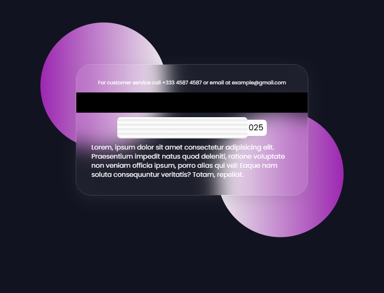

# Flipping Credit Card UI

Interactive **Credit Card UI** with **3D Flip Animation** built using **HTML & CSS** only.  
Hovering over the card flips it to show the back side with a magnetic strip, signature area, and terms text.


## 🔗 Live Demo

[**View Live Demo Here**](https://m7med-os.github.io/Flipping-Card-UI-Design-in-HTML-CSS/)  

---

## ✨ Features

- **3D Card Flip Animation** using `transform` and `perspective`.
- **Glassmorphism Design** with `backdrop-filter`.
- **Responsive Layout** with smooth hover effects.
- **Realistic Card Elements**:
  - Card Number, Holder Name, Valid Thru Date.
  - Magnetic Strip & Signature Area.
  - Terms & Conditions section.

---

## 🛠️ Technologies Used

- **HTML5** for structure.
- **CSS3** for styling & 3D flip animation.
- **Google Fonts (Poppins)** for modern typography.
- **CSS Gradients & Shadows** for glass effect and realism.

---

## 📂 Project Structure

```
Flipping-Card-UI/
│
├── index.html        # Main HTML structure
├── css/
│   ├── normalize.css # CSS reset
│   └── style.css     # Main styles
├── data/
│   └── images/
│       ├── logo.png  # Card logo (e.g. Mastercard)
│       ├── chip.png  # EMV chip image
│       └── preview.png # for README
└── README.md         # Project documentation
```

---

## 🚀 How to Run

1. **Clone the repository**:
   ```bash
   git clone https://github.com/M7MED-Os/Flipping-Card-UI-Design-in-HTML-CSS.git
   ```
2. **Open `index.html`** in any modern browser.
3. **Hover over the card** to see the 3D flip animation.

---

## 📸 Preview

Front Side:


Back Side:



---

## 📌 Future Enhancements

- Add **JavaScript** to dynamically update card info from input fields.
- Improve **mobile experience** with touch-based flip animation.
- Add **multiple card styles** (Visa, Amex, etc.).

